# AI Cookbook 🤖🍲

## AI Cookbook is an innovative web application that combines AI-powered recipe generation with an intuitive user interface. Discover new recipes, manage your pantry, and enjoy a personalized cooking experience with AI Cookbook.

## 🚀 Getting Started
To start using AI Cookbook, simply visit [aicookbook.app](https://www.aicookbook.app) and create a free account. 
Add some ingredients and let the AI generate recipes for you!
---
## 💡 Features
* 🍽️ AI-generated recipes based on your pantry items
* 🌙 Dark and light modes for a comfortable browsing experience
* 🗃️ Save your favorite recipes for easy access
* 🛠️ Customize your pantry to match your real-life inventory
---
## 📸 Screenshots
**`Home Page Dark/Light Mode`**
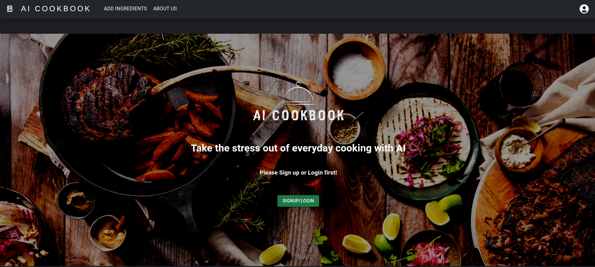
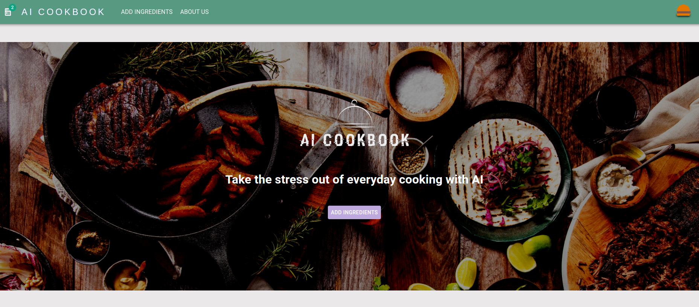
---
**`Settings Dark/Light Mode, Select Your AI Voice!`**
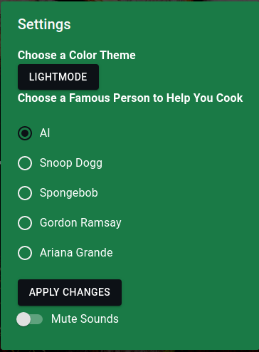
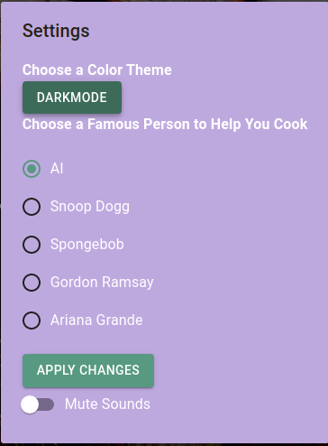
---
**`Add Ingredients Dark Mode`**
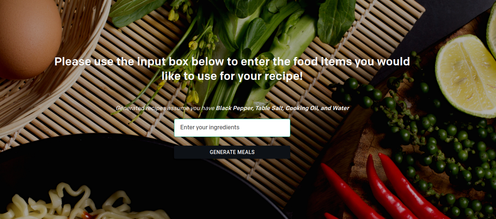
---
**`Open Pantry That Populates with Ingredients!`**
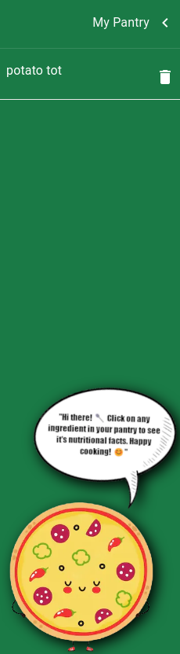
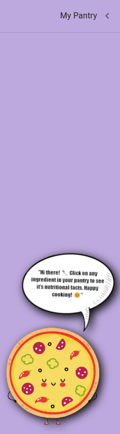
---
**`Login Dark/Light Mode`**
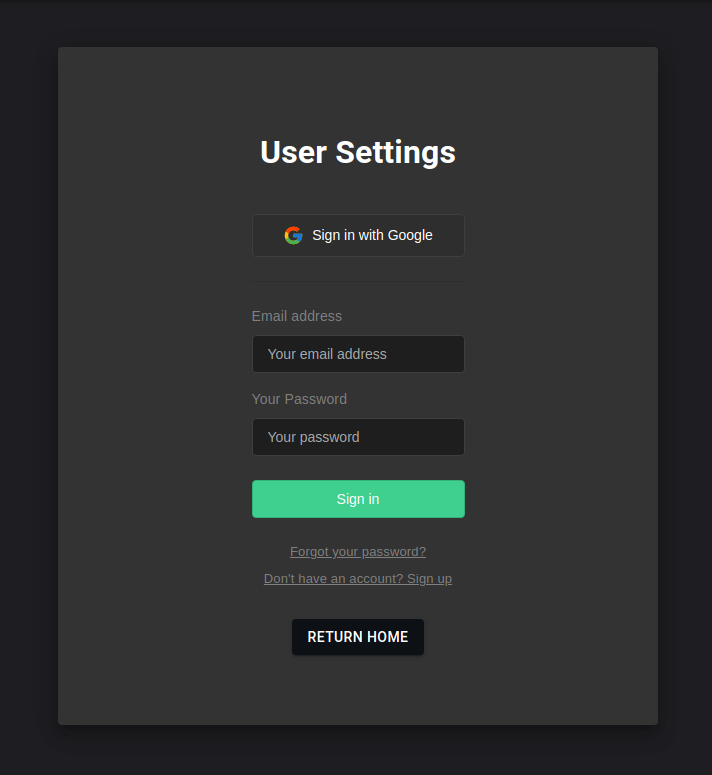
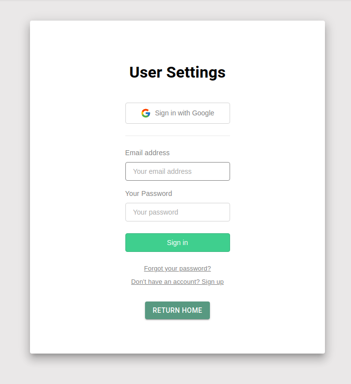
---
**`Favorites Dark/Light Mode`**
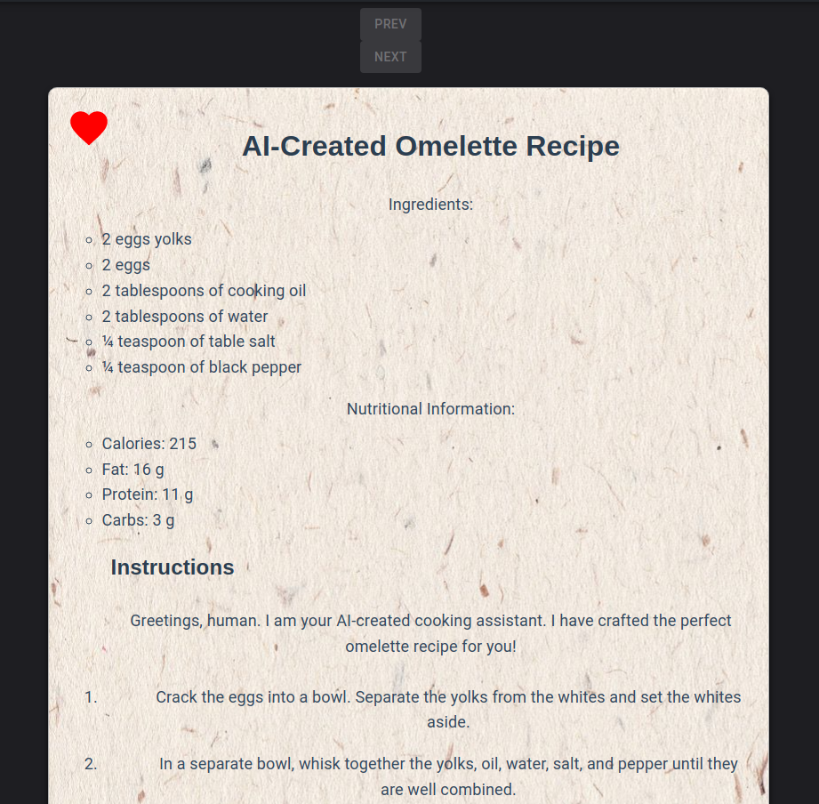
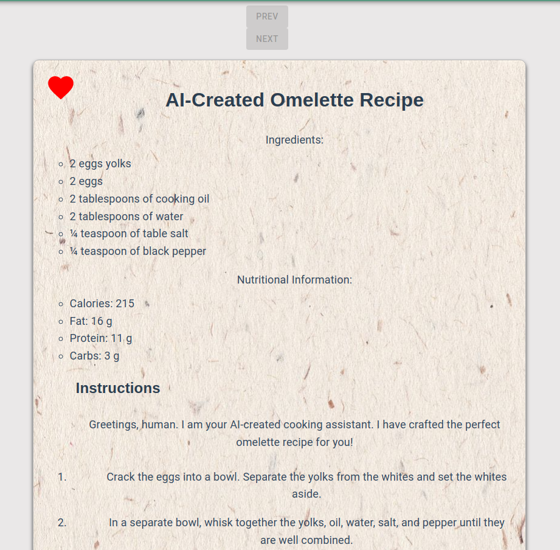
---
## 💻 Technologies
| Technology Name | Link |
|-----------------|------|
| `Next.js` | https://nextjs.org |
| `Supabase` | https://supabase.com |
| `Material UI` | https://mui.com |
| `Vercel` | https://vercel.com |
| `Spoonacular` | https://spoonacular.com/food-api |
| `OpenAI` | https://openai.com |
| `ElevenLabs` | https://beta.elevenlabs.io |
---
## 👨‍💻 Developers
|Name | Github | LinkedIn |
|-----|--------|----------|
|Ryan Pearl | [Github](https://github.com/ryanpearl48) | [LinkedIn](https://www.linkedin.com/in/ryanpearl48/) |
|Jay Yuan | [Github](https://github.com/jayqyuan) | [LinkedIn](https://www.linkedin.com/in/jayqyuan/) |
|Cody DiBella | [Github](https://github.com/CodyDiBella) | [LinkedIn](https://www.linkedin.com/in/codydibella/) |
|Ben Villafranca | [Github](https://github.com/bevilla203) | [LinkedIn](https://www.linkedin.com/in/ben-villafranca/) |
-------------------------------------

## 📜 License
This project is licensed under the MIT License.
