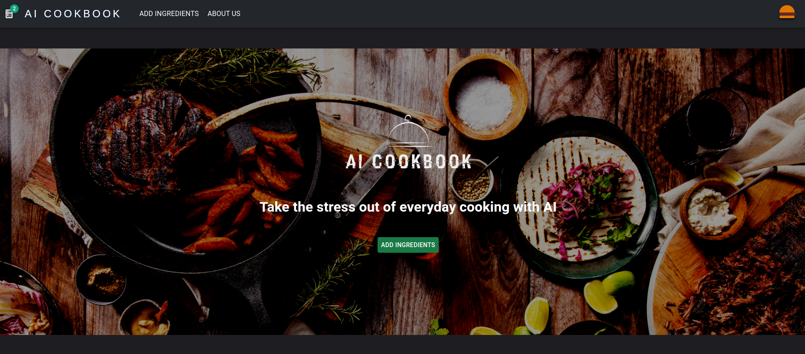

Description

---
The Pages of AI CookBook
---
---
**`Home Page Dark/Light Mode`**

---
---
**`Settings Dark/Light Mode`**

---

---
**`Add Ingredients Dark Mode`**

---

---
**`Login Dark/Light Mode`**

---

**`Favorites Dark/Light Mode`**

---

---
Technology
---
| Technology Name | Link |
|-----------------|------|
| `Next.js` | https://nextjs.org |
| `Supabase` | https://supabase.com |
| `Material UI` | https://mui.com |
| `Vercel` | https://vercel.com |
| `Spoonacular` | https://spoonacular.com/food-api |
| `OpenAI` | https://openai.com |
| `ElevenLabs` | https://beta.elevenlabs.io |

---
Developers
---
|Name | Github | LinkedIn |
|-----|--------|----------|
|Ryan Pearl | [Github](https://github.com/ryanpearl48) | [LinkedIn](https://www.linkedin.com/in/ryanpearl48/) |
|Jay Yuan | [Github](https://github.com/jayqyuan) | [LinkedIn](https://www.linkedin.com/in/jayqyuan/) |
|Cody DiBella | [Github](https://github.com/CodyDiBella) | [LinkedIn](https://www.linkedin.com/in/codydibella/) |
|Ben Villafranca | [Github](https://github.com/bevilla203) | [LinkedIn](https://www.linkedin.com/in/ben-villafranca/) |
-------------------------------------
